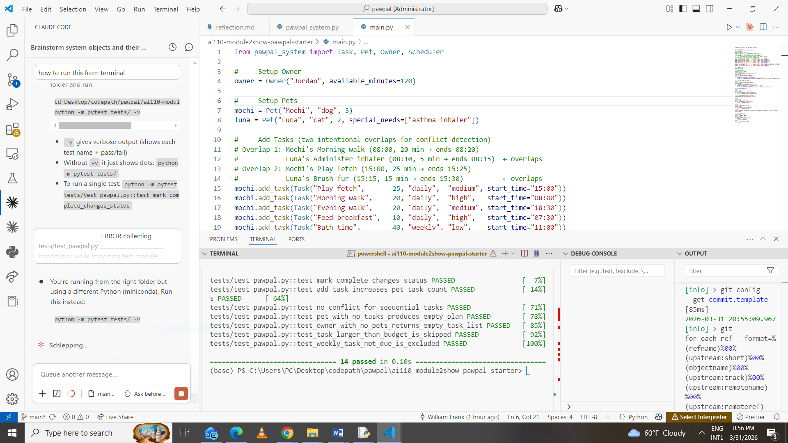

# PawPal+ (Module 2 Project)

You are building **PawPal+**, a Streamlit app that helps a pet owner plan care tasks for their pet.

## Scenario

A busy pet owner needs help staying consistent with pet care. They want an assistant that can:

- Track pet care tasks (walks, feeding, meds, enrichment, grooming, etc.)
- Consider constraints (time available, priority, owner preferences)
- Produce a daily plan and explain why it chose that plan

Your job is to design the system first (UML), then implement the logic in Python, then connect it to the Streamlit UI.

## What you will build

Your final app should:

- Let a user enter basic owner + pet info
- Let a user add/edit tasks (duration + priority at minimum)
- Generate a daily schedule/plan based on constraints and priorities
- Display the plan clearly (and ideally explain the reasoning)
- Include tests for the most important scheduling behaviors

## Getting started

### Setup

```bash
python -m venv .venv
source .venv/bin/activate  # Windows: .venv\Scripts\activate
pip install -r requirements.txt
```

## Testing PawPal+

To run the tests, make sure you're inside the project folder and run:

```bash
python -m pytest tests/ -v
```

I wrote 14 tests total covering the parts of the system I was most worried about breaking. The main things I tested were whether the scheduler actually respects the time budget, whether high-priority tasks end up before low-priority ones, and whether completing a daily or weekly task correctly creates a new one for the next day or next week. I also added a few edge cases like what happens when a pet has no tasks, or when a single task is longer than the entire time budget — both of these used to silently do nothing, so I wanted to make sure they still returned cleanly without crashing.

The conflict detection tests were important too — I wanted to make sure two tasks starting at overlapping times would get flagged, but tasks that run back-to-back wouldn't be falsely reported as conflicts.

**All 14 tests passed** — screenshot below as evidence:



**Confidence level: 4/5**

I'm pretty confident the scheduling logic and recurrence work correctly. The main thing I'm not fully sure about yet is the Streamlit UI layer — I haven't written any automated tests for that side, so there could still be edge cases in how the app handles user input. That would be the next thing to tackle.

---

## Smarter Scheduling

The scheduler goes beyond a simple priority list. Key features:

- **Priority + duration sorting** — tasks are sorted high → medium → low priority; within the same priority, shorter tasks are scheduled first to fit more into the time budget.
- **Preferred time slots** — tasks tagged `morning`, `afternoon`, or `evening` are ordered within their priority group accordingly.
- **Recurring task automation** — when a `daily` task is marked complete, a new instance is automatically created due tomorrow (`today + timedelta(days=1)`). Weekly tasks recur in 7 days.
- **Filtering** — filter planned tasks by pet name, completion status (pending/done), or view all.
- **Conflict detection** — `get_conflicts()` checks every pair of timed tasks for overlapping time ranges and returns human-readable warnings without crashing the app.

### Suggested workflow

1. Read the scenario carefully and identify requirements and edge cases.
2. Draft a UML diagram (classes, attributes, methods, relationships).
3. Convert UML into Python class stubs (no logic yet).
4. Implement scheduling logic in small increments.
5. Add tests to verify key behaviors.
6. Connect your logic to the Streamlit UI in `app.py`.
7. Refine UML so it matches what you actually built.
